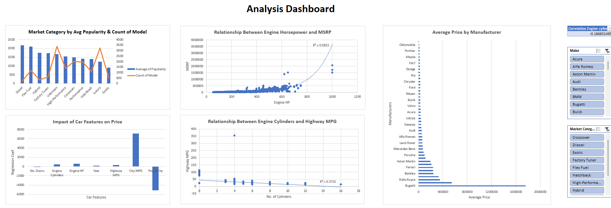

# 🚗 Car Feature Dataset Dashboard

This project explores a car specification dataset to uncover what features influence car pricing, popularity, and fuel efficiency. An interactive Excel dashboard was created using pivot tables, charts, and regression analysis.

---

## 📌 Objectives

- Identify which features most affect MSRP (price)
- Compare pricing across transmission types, engine types, and body styles
- Analyze brand vs. feature impact (e.g., luxury vs. standard)
- Explore fuel efficiency across models and engines

---

## 🧰 Tools Used

- Microsoft Excel (Pivot Tables, Charts, Formulas)
- Regression Analysis (Scatter plot + trendline)
- Data Cleaning using Excel formulas

---

## 📊 Key Insights

- **City MPG** and **Engine Horsepower** are the top predictors of car price  
- **Automated Manual** and **Direct Drive** transmissions are found in premium models  
- **Diesel** and **Flex Fuel** engines are most common among high-selling cars  
- **Luxury brands** like Bugatti and Rolls-Royce show significantly higher MSRP  
- Cars with **fewer cylinders** have better fuel efficiency but lower power output

---

## 📁 Files

- [`car-feature-dashboard.xlsx`](./car-feature-dashboard.xlsx): Interactive Excel dashboard  
- [`car-feature-dashboard-report.pdf`](./car-feature-dashboard-report.pdf): Project report with visuals and explanations  
- [`regression-analysis.png`](./regression-analysis.png): Visual showing relationship between features and price  

---

## 📷 Screenshots

### Dashboard Preview:

---

## 🧠 Summary

This project demonstrates how Excel can be used not just for business reporting, but also for data exploration and analytical storytelling. The dashboard provides clear insights that would help both consumers and automotive marketers understand what truly drives car pricing.

